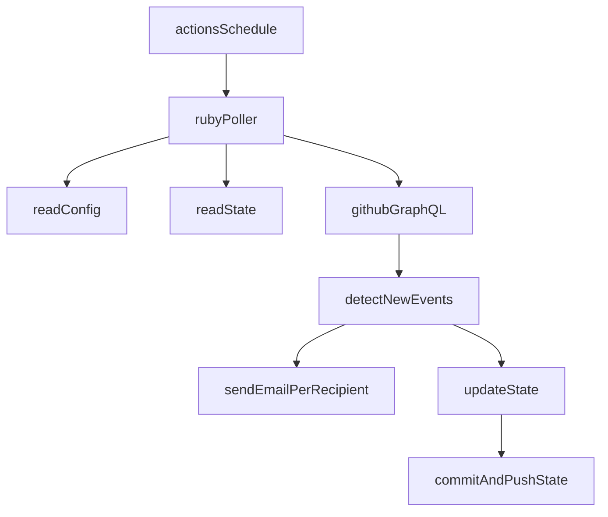

# GitHub Polling Notification System for Fork Usage (Ruby + Actions + GraphQL + Gmail SMTP)

## Purpose and Assumptions

- Each user **forks** this repository and runs it with their own GitHub Actions
- Targets are **public repositories** (including those not owned by the user)
- Notification events are selectable per repo (only those listed in config are notified)
- `releases` (Release published)
- `pull_requests_created` (PR created)
- `pull_requests_merged` (PR merged)
- `issues` (Issue created. PRs are excluded)
- Cron uses GitHub Actions `schedule` (ideally 5 minutes, fallback to 10 minutes if needed)
- API uses **polling** (GraphQL preferred)
- Email uses **Gmail/Google Workspace SMTP** (configured via Secrets)
- State is persisted by updating files in the repository via **commit/push**
- Internal time comparison and state storage are **fixed to UTC (RFC3339, `Z` suffix)**. `timezone` is for email display only.

## Architecture/Data Flow

## Files to Add to Repository (Draft)

- Configuration
- `.octonotify/config.yml` (edited by users)
- State
- `.octonotify/state.json` (updated by Actions. Normally not edited manually)
- Ruby Application
- `Gemfile` / `Gemfile.lock`
- `bin/octonotify` (entry point)
- `lib/octonotify/...` (GraphQL client, polling, diff extraction, email sending, state management)
- GitHub Actions
- `.github/workflows/octonotify.yml`
- Documentation
- `README.md` (fork instructions, Secrets, configuration examples, operations, troubleshooting)

## Gems to Use (Minimal and Sufficient)

- Runtime
  - `faraday` (HTTP client for GitHub GraphQL)
  - `faraday-retry` (retry for transient errors)
  - `mail` (email composition and per-recipient sending via SMTP)
  - `tzinfo` (display time conversion using IANA timezone. Internal/state is UTC fixed)
- Development/Test
  - `rspec` (testing)
- Development
  - `rubocop` (static analysis/code style)

## config.yml (Minimal)

- `timezone`: IANA TZ (e.g., `UTC`, `Asia/Tokyo`). Defaults to `UTC` if not specified.
- `from`: Display name + address (e.g., `Octonotify <noreply@example.com>`)
- `to`: Array of recipients (sent separately per recipient)
- `repos`: Map (key = `owner/repo`)
- `events`: Array (any of `releases`, `merged_prs`, `issues`. Only listed ones are notified)

※Internal parameters (chunk size, etc.) are not exposed in config, fixed to defaults. Advanced users can override via environment variables if needed.

## state.json (Robust: Minimize Missed Events / Prevent Duplicates)

- Root
- `initialized_at`: Initial initialization time (UTC RFC3339 `Z`)
- `notify_after`: Initially `initialized_at` (boundary for not notifying past events)
- `last_run`: `started_at`, `finished_at`, `status`, `rate_limit(cost, remaining, reset_at)` (no summary)
- `repos`: Map (key = `owner/repo`)
- `repos[owner/repo]`
- `url` (repo URL. Always included in emails)
- `events` (state for each of `releases`/`merged_prs`/`issues`)
- Per-event state (common)
- `watermark_time`: Boundary indicating "processed up to here" (does not advance if processing is incomplete)
- `resume_cursor`: Continuation position if processing was incomplete (resume from here next time)
- `recent_notified_ids`: Ring buffer of notified IDs (prevents re-notification even with same timestamp/order variations)
- `last_success_at`
- (Optional) `incomplete`, `reason`

## Polling Algorithm (Key Points)

- Fetch repos in chunks via GraphQL (e.g., 20-25 repos/request)
- Fetch minimal fields
- Release: title/tag/url/publishedAt/id + repo url
- PR: title/url/mergedAt/id/author(login)/mergedBy(login) + repo url
- Issue: title/url/createdAt/id/author(login) + repo url
- Deduplication
- Notification decision is **ID-based** (only notify those not in `recent_notified_ids`)
- Minimize missed events
- Look back to `threshold = watermark_time - lookback_window(fixed: 30 minutes)`
- If cost/rate limit is reached mid-processing, save `resume_cursor` and exit without advancing `watermark_time` (do not fail silently)
- First run
- Save `notify_after = now` and only notify `event_time >= notify_after` (do not notify past events even with lookback)

## Email (1 execution = 1 email / sent per recipient)

- Send same digest content per recipient (recipients are hidden from each other)
- Group by repo and always include repo URL
- Display time converted using `timezone` (internal/state is UTC fixed)

## GitHub Actions (Run Safely)

- `on: schedule` + `workflow_dispatch` only (does not trigger on push. Prevents loops from state commits)
- Use `concurrency` to prevent concurrent execution (prevents state update conflicts)
- `permissions: contents: write` (for committing/pushing state.json)
- Only commit/push when state changes (include `[skip ci]` etc. in message)

## Secrets (Configure per Fork)

- SMTP: `SMTP_HOST`, `SMTP_PORT`, `SMTP_USERNAME`, `SMTP_PASSWORD`
- Send control: `MAIL_FROM_OVERRIDE` etc. as needed (to comply with Gmail constraints. Add notes in README)
- GitHub API: Basic `GITHUB_TOKEN`. Optional PAT can be added if rate limits are strict.
