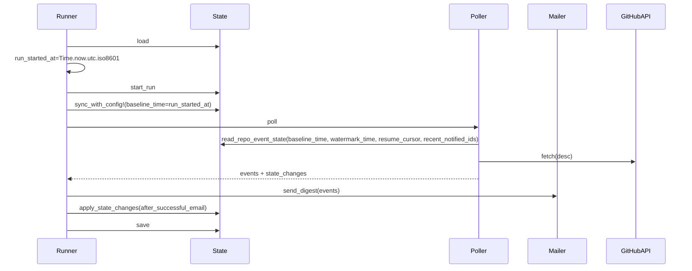

# Prevent backfill on newly added repos/events

## Context / current behavior

- When a repo or event type is newly added in config, there is **no explicit “added at” timestamp** stored.
- `Octonotify::Poller` treats missing per-repo/event state as:
  - `watermark_time = state.notify_after`
  - `resume_cursor = nil`
- `state.notify_after` is initialized when the state file is first created and **does not automatically move forward when config changes**.
- Because GitHub GraphQL queries are ordered **DESC** (newest first), if `state.notify_after` is old, the first run after adding a repo can scan and potentially notify a large historical range.

Relevant code:

- [`lib/octonotify/state.rb`](../lib/octonotify/state.rb) (`notify_after`, `new_event_state`)
- [`lib/octonotify/poller.rb`](../lib/octonotify/poller.rb) (`peek_event_state`, `calculate_threshold`, `should_notify?` filter)
- [`lib/octonotify/graphql_client.rb`](../lib/octonotify/graphql_client.rb) (orderBy DESC)

## Goal

- For a **newly added repo** or **newly added event type** in an existing repo, start from **the next run start time** (baseline) and **do not notify any events earlier than that baseline**.
- Avoid scanning too far back on first run after adding.
- Optimize for **clean code** over backward compatibility (this project is not published yet).

## Proposed approach (cleaner architecture, no backward compatibility)

### 1) Make state explicit and self-sufficient (new state schema)

Replace the implicit global `notify_after` behavior with a per-repo/event baseline.

New event state fields:
- `baseline_time`: When this repo+event became active (set when config introduces it).
- `watermark_time`: Latest event time successfully processed (moves forward only on successful email delivery).
- `resume_cursor`, `recent_notified_ids`, `last_success_at`, `incomplete`, `reason`: same intent as today.

Suggested `state.json` structure:

```json
{
  "last_run": {
    "started_at": "2026-01-02T12:00:00Z",
    "finished_at": "2026-01-02T12:00:10Z",
    "status": "success",
    "rate_limit": { "remaining": 4900 }
  },
  "repos": {
    "owner/repo": {
      "url": "https://github.com/owner/repo",
      "events": {
        "release": {
          "baseline_time": "2026-01-02T12:00:00Z",
          "watermark_time": "2026-01-02T12:00:00Z",
          "resume_cursor": null,
          "recent_notified_ids": [],
          "last_success_at": null,
          "incomplete": false,
          "reason": null
        }
      }
    }
  }
}
```

Planned code changes:
- In [`lib/octonotify/state.rb`](../lib/octonotify/state.rb):
  - Replace the persisted state format (no migration). Assume `.octonotify/state.json` will be deleted once during rollout.
  - Remove the global `initialized_at` / `notify_after` fields and `State#should_notify?` (the baseline becomes per repo/event).
  - Add `sync_with_config!(config, baseline_time:)`:
    - Create missing repos/events in `@repos` with `baseline_time = baseline_time` and `watermark_time = baseline_time`.
    - Prune repos/events not present in config (keeps state tidy).

### 2) Move “new repo/event initialization” out of Poller (simplify Poller)

Today, Poller has to guess missing state (`peek_event_state`). To keep code clean:
- Make `Runner` call `state.sync_with_config!` before polling.
- Remove the “missing state fallback” path from Poller; Poller can assume state exists.

Planned code changes:
- In [`lib/octonotify/runner.rb`](../lib/octonotify/runner.rb):
  - Capture `run_started_at = Time.now.utc.iso8601` at the start of `run`.
  - Call `state.start_run` and then `state.sync_with_config!(config, baseline_time: run_started_at)` before `poller.poll`.
  - Persist config-sync changes even if email fails, but **only** config-derived fields (baseline initialization and pruning).
    - This does **not** create missed notifications because it does not advance `watermark_time` based on delivery outcomes.
    - It prevents misses when a new repo/event is added and the first run fails: without persisting the baseline, the next run would pick a later baseline and could skip events created between the two runs.
  - Keep the existing no-miss policy for poll results:
    - Do not persist `recent_notified_ids` / watermark advances unless email delivery succeeds.

### 3) Clamp the lookback window using baseline_time

Keep `LOOKBACK_WINDOW` to avoid edge misses, but never scan before baseline.

Planned code changes:
- In [`lib/octonotify/poller.rb`](../lib/octonotify/poller.rb):
  - Remove the missing-state fallback (`peek_event_state`); assume state has been synced by Runner.
  - Replace the current threshold calculation with:
    - `threshold = [Time.parse(watermark_time) - LOOKBACK_WINDOW, Time.parse(baseline_time)].max`
  - Ensure watermark never regresses:
    - Only advance watermark forward.
    - Never set `watermark_time` < `baseline_time`.

### 4) Tests (updated to the new state model)

Update/add specs in:
- [`spec/octonotify/poller_spec.rb`](../spec/octonotify/poller_spec.rb)
- [`spec/octonotify/state_spec.rb`](../spec/octonotify/state_spec.rb)
- Optionally: [`spec/octonotify/runner_spec.rb`](../spec/octonotify/runner_spec.rb) for `sync_with_config!` being invoked.

High-signal test cases:
- **New repo added**: baseline is run start time; events older than baseline are never notified.
- **New event type added**: same baseline behavior as new repo.
- **Lookback clamp**: watermark-lookback never goes earlier than baseline.
- **Fresh state**: deleting the existing `.octonotify/state.json` leads to correct baseline initialization on the next run.

### 5) Documentation

Update [`README.md`](../README.md) to clarify:
- Newly added repos/event types start notifying from the next run start time.
- There is intentionally no automatic backfill.

## Data flow (after change)



## Rollout / migration notes

- This change intentionally breaks the previous `state.json` format.
- Recommended rollout:
  - Delete `.octonotify/state.json` in the repo once.
  - The next GitHub Actions run will create and commit the new state file.

